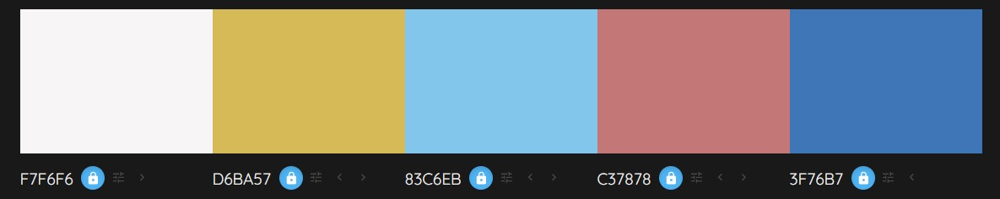

Design Guide
============

## Color Palate 

*The middle blue is the main theme color used in most UI elements, whereas the others are accent colors.*

The same colors in rgba in the above order are:    
* white: `rgba(247, 246, 246, 1.0)`
* yellow: `rgba(214, 186, 87, 1.0)`
* blue: `rgba(131, 198, 235, 1.0)`
* red: `rgba(195, 120, 120, 1.0)`
* dark blue: `rgba(63, 118, 183, 1.0)`

